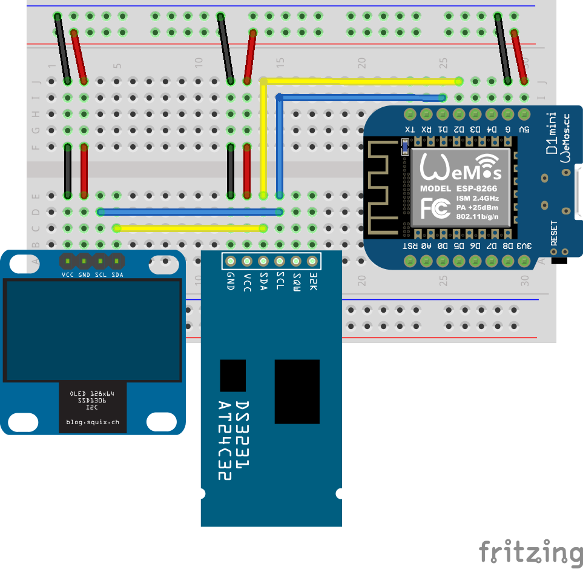

# WeMos D1 Mini Real Time Oled Clock
Project explains how to connect DS3231 Real Time Clock and SSD1306 OLED display to WeMos D1 Mini to make simple digital clock for projects like home weather station.

Project depends on external Arduino libraries
* [ESP8266 OLED SSD1306](https://github.com/ThingPulse/esp8266-oled-ssd1306)
* [RTClib](https://github.com/adafruit/RTClib)

## Pin connection

| WeMos D1 Mini | SSD1306/DS3231 |
|:-------------:|:--------------:|
| 5V            | 5V             |
| GND           | GND            |
| D1            | SCL            |
| D2            | SDA            |

Following picture how RTC and OLED should be connected with WeMos D1 Mini.

## License
This project is licensed under the MIT License - see the [LICENSE.md](License.md) file for details.
